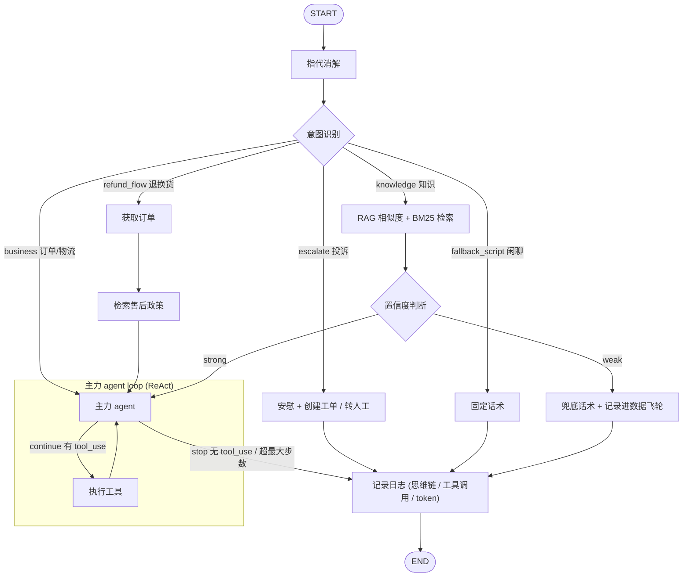

# Workflow

1. 指代消解 (提示词优化): 她多少钱? -> iPhone17 多少钱?
2. 意图识别: 用户问的是商品, 还是订单, 还是物流, 还是退换货/退款/售后, 还是投诉, **还是单纯闲聊**
3. 意图分流
   - 闲聊: 回复固定话术
   - 知识类问题: RAG 相似度搜索 + BM25 关键词检索
   - 订单/物流等: 直接转 4
   - 投诉: 先安慰, 再提供创建工单和转人工选项
4. 主力 agent loop, 进入主力 agent loop 前, 有一道置信度闸: 判断检索到的知识是否足够回答该问题, 如果不够, 则回复兜底话术, 同时记录该问题, 流转给后续的数据飞轮处理
5. 记录日志, 记录 workflow 模型的思维链、工具调用、token 消耗, 保证可观测性

## 主力 agent loop

ReAct: Thinking -> Act -> Observe

2 种 agent loop 退出条件

1. LLM 决定退出循环: LLM API 响应中没有 tool_use, stop reason 是 end_turn (Anthropic)
2. 设置最大循环次数, 超过最大循环次数后强制退出循环; langchain 的 maxIteration 默认 15, claude 的 max turns 默认 ?

token 消耗不能作为退出条件

### 不用 workflow 全部使用 agent loop?

1. 排查问题, 相同的用户提问, 跑两遍 agent, 思维链可能不同、调试、监控和排查难度大
2. 可能遗漏步骤, 例如知识类问题遗漏知识检索, 导致幻觉
3. 响应速度慢

## Workflow

```ts
import { END, START, StateGraph } from "@langchain/langgraph";
import type { BaseCheckpointSaver } from "@langchain/langgraph";

import * as nodes from "./nodes.ts";
import { confidenceGate, routeByIntent, shouldContinue } from "./routing.ts";
import { ConversationState } from "./state.ts";

export function buildGraph(checkpointer?: BaseCheckpointSaver) {
  const builder = new StateGraph(ConversationState)
    .addNode("resolve_reference", nodes.resolveReference) // 指代消解
    .addNode("classify_intent", nodes.classifyIntent) // 意图识别
    .addNode("retrieve_knowledge", nodes.retrieveKnowledge) // 知识检索
    .addNode("confidence_check", nodes.confidenceCheck) // 置信度判断
    .addNode("main_agent", nodes.mainAgent) // 主力 agent loop
    .addNode("agent_tools", nodes.agentTools)
    .addNode("complaint_reply", nodes.complaintReply)
    .addNode("script_reply", nodes.scriptReply)
    .addNode("fallback_reply", nodes.fallbackReply) // 兜底话术
    .addNode("fetch_order", nodes.fetchOrder)
    .addNode("retrieve_policy", nodes.retrievePolicy)
    .addNode("log", nodes.logNode)
    // 指代消解 -> 意图识别
    .addEdge(START, "resolve_reference")
    .addEdge("resolve_reference", "classify_intent") // 指代消解完成后, 进入意图识别
    .addConditionalEdges("classify_intent", routeByIntent, {
      escalate: "complaint_reply",
      fallback_script: "script_reply",
      knowledge: "retrieve_knowledge", // 知识类问题 -> 知识检索
      refund_flow: "fetch_order", //
      business: "main_agent", // 业务类 -> 主力 agent loop
    })
    .addEdge("fetch_order", "retrieve_policy")
    .addEdge("retrieve_policy", "main_agent")
    .addEdge("retrieve_knowledge", "confidence_check") // 知识检索后, 进入置信度判断
    .addConditionalEdges("confidence_check", confidenceGate, {
      strong: "main_agent",
      weak: "fallback_reply",
    }) // 置信度判断
    .addConditionalEdges("main_agent", shouldContinue, {
      continue: "agent_tools",
      stop: "log",
    })
    .addEdge("agent_tools", "main_agent")
    .addEdge("complaint_reply", "log")
    .addEdge("script_reply", "log")
    .addEdge("fallback_reply", "log")
    .addEdge("log", END);
  return builder.compile(checkpointer === undefined ? {} : { checkpointer });
}
```



## 意图识别

1. 关键词匹配
2. 训练一个分类器
3. LLM Prompt

### 意图数量很多?

- 两级分类
  - 1 级: 售前 / 物流 / 售后
  - 2 级: 细分意图
- RAG + 意图识别: RAG 召回最相关的 topK 个候选意图, 提供给模型选择

## 意图分流
