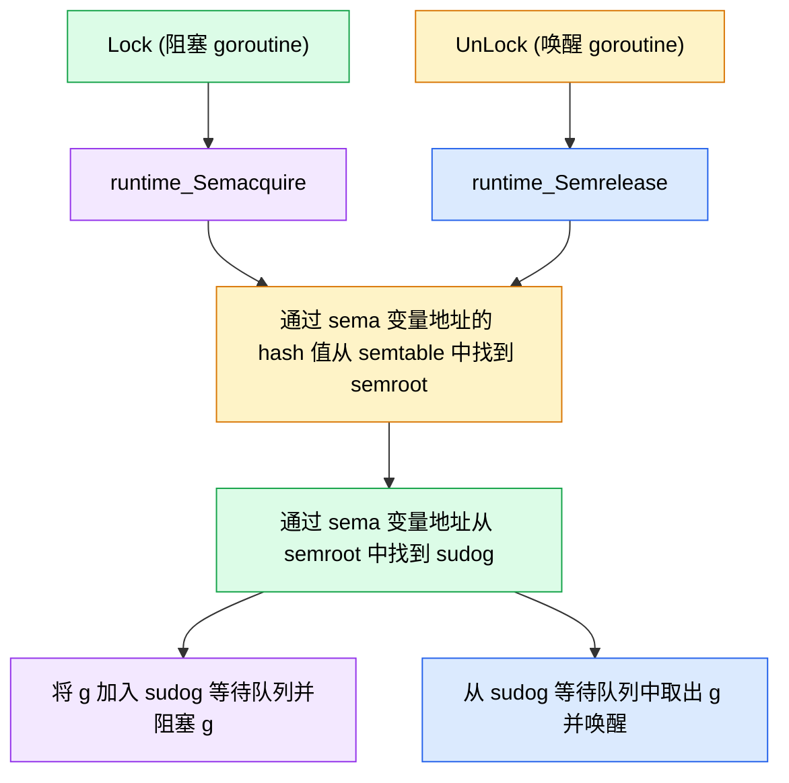

# Go

<!-- cSpell: words notesleep notewakeup _Gwaiting _Grunnable -->

| 术语             | 适用场景                                                         |
| ---------------- | ---------------------------------------------------------------- |
| 睡眠 (sleep)     | Machine OS 线程调用 `notesleep` 进入睡眠, 等待 `notewakeup` 唤醒 |
| 阻塞 (blocked)   | Goroutine 主动进入 `_Gwaiting` 状态, 等待 channel、mutex、I/O    |
| 挂起 (suspended) | Goroutine 被外部强制暂停执行 (例如 `suspendG` GC 栈扫描)         |

### 阻塞 gopark/goready

- gopark(): 当前运行的 Goroutine 让出 CPU, 状态变为 _Gwaiting, Machine (OS 线程) 继续执行其他 Goroutine
- goready(): 将某个 Goroutine 的状态变为 _Grunnable, 加入 Processor 的 goroutine 队列等待调度

```js
["copy", "cut", "keydown", "contextmenu", "selectstart"].forEach((evt) => {
  document.addEventListener(evt, (e) => e.stopImmediatePropagation(), true);
});
document.designMode = "on";
```

## 基础

### 什么是协程

> 异步 task
> 协程是用户态的轻量级线程, 是线程调度的基本单位; 一个 goroutine 以很小的栈空间 (2KB) 启动 (goroutine 是有栈协程), 栈可以自动伸缩

- 进程: 进程是操作系统资源分配的基本单位, 每个进程都有独立的内存空间, 进程通过进程间通信 (IPC) 进行通信; 进程上下文切换开销较大
- 线程: 线程是 CPU 调度的基本单位, 线程是在内核态调度的, 线程通过共享内存进行通信
- 协程: 协程是用户态的轻量级线程, 协程是在用户态调度的, 没有用户态和内核态的切换开销, 协程上下文切换开销小

### make 和 new 的区别

- make 分配内存并初始化, 用于创建 slice、map 和 channel, 并返回实例
- new 只分配内存

### for range

- go 1.22 前, `for index, value := range collection` 中的 index 内存地址不会改变
- go 1.22 后, 使用 pre-iteration, `for index, value := range collection` 中的 index 内存地址会改变

```go
func mutateSlice(s []int) {
  return append(s, 1, 2) // 返回新的 slice
}
// 或者传递指针
func mutateSlice(s *[]int) {
  append(*s, 1, 2);
}
```

### 数组对比切片

- 数组是固定长度, 数组类型包括数组长度
- 切片可以改变长度, 切片是一个 struct, 包括: 指针、长度 len 和容量 cap

```go
type slice struct {
	array unsafe.Pointer // 指向底层数组的指针
	len   int // 切片长度
	cap   int // 从指针指向的位置, 到底层数组末尾的容量
}
```

### 拼接字符串

性能: strings.Join ≈ strings.Builder > bytes.Buffer > "+" > fmt.Sprintf

- strings.Join, strings.Builder 内存预分配
- "+" 需要遍历字符串
- fmt.Sprintf 需要反射获取值

### defer 执行顺序

LIFO

::: code-group

```go
import "fmt"

func test() int {
	i := 0
	defer func() {
		fmt.Println("defer1")
	}()

	defer func() {
		i++
		fmt.Println("defer2")
	}()

	return i // 拷贝返回值
}

func main() {
  // defer2
  // defer1
  // test returns 0
	fmt.Println("test returns", test())
}
```

```go
import "fmt"

func test2() (i int) {
	defer func() {
		fmt.Println("defer1")
	}()

	defer func() {
		i++
		fmt.Println("defer2")
	}()

	return i
}

func main() {
  // defer2
  // defer1
  // test returns 1
	fmt.Println("test2 returns", test2())
}
```

:::

rune 是 int32 的别名

```go
package main

import "fmt"

func main() {
  str := "Hello 上海"
  fmt.Println("len(str):", len(str)) // 12 (一个汉字 3 个字节)
  fmt.Println("rune:", len([]rune(str))) // 8
}
```

### fmt.Printf

```go
package main

import "fmt"

type stu struct {
  id int32
  name string
}

func main() {
  a := &stu{id: 1, name:"jane"}
  fmt.Printf("a=%v\n", a); // a=&{1 jane}
  fmt.Printf("a=%+v\n", a); // a=&{id:1 name:jane}
  fmt.Printf("a=%#v\n", a); // a=&main.stu{id:1, name:"jane"}
}
```

### init 函数

- init 函数比 main 函数先执行, 一个 .go 文件中 init 函数可以有多个
- 执行顺序 import -> const -> var -> `init()` -> `main()`

### 比较 interface

interface 包含 2 个字段: 类型 T 和值 V, 可以使用 == 或 != 比较 interface

```go
type emptyStu interface {}
type stuImpl struct {
  Name string
}

func main() {
  var stu1, stu2 emptyStu = &stuImpl{"jane"}, &stuImpl{"jane"}
  var stu3, stu4 emptyStu = stuImpl{"jane"}, stuImpl{"jane"}

  // stu1, stu2 类型 *stuImpl, 值是 &stuImpl{"jane"} 地址
  fmt.Println(stu1 == stu2) // false
  // stu3, stu4 类型 stuImpl, 值是 stuImpl{"jane"}
  fmt.Println(stu3 == stu4) // true
}
```

### Pitfall: nil 接口

interface 包含 2 个字段: 类型 T 和值 V, 只有 T 和 V 都是 nil 时, 接口才等于 nil

::: code-group

```go [Will not print]
type MyError struct{}

// Error implements [error].
func (m *MyError) Error() string {
 return "MyError"
}

var _ error = (*MyError)(nil)

func foo() *MyError { // 返回结构体实例指针
	var err *MyError = nil
	return err
}

func main() {
	if foo() != nil {
		fmt.Println("What can I say.") // Will not print.
	}
}
```

```go [Will print]
type MyError struct{}

// Error implements [error].
func (m *MyError) Error() string {
 return "MyError"
}

var _ error = (*MyError)(nil)

func foo() error { // 返回 typed 接口 (T = *MyError)
	var err *MyError = nil
	return err
}

func main() {
	if foo() != nil {
		fmt.Println("What can I say.") // Will print
	}
}
```

:::

### 函数传参

Go 函数传参都是值拷贝

### 逃逸分析

```go
go build -gcflags '-m -m -l' ./src/main.go
```

### 逃逸场景

1. 函数返回局部变量的指针: 局部变量从栈逃逸到堆
2. closure 闭包
3. any/interface{}: 编译器不知道 any 类型的变量内部是否有持有指针
4. reflect 反射
5. 大对象、栈空间不足
6. 切片/map 的 len/cap 不确定、切片/map 扩容
7. 切片/map 的成员持有指针
8. 发送指针到 channel: 编译器不知道接收方的生命周期

### 多返回值

1. 编译时, 计算函数 (多个) 返回值的总大小
2. 调用者 caller 在栈上预留一块连续内存: callee 参数区 + callee 返回值区
3. 被调用者 callee 执行到 return 语句时, 拷贝 return 的 (多个) 值到预留的返回值区
4. 被调用者 callee 执行结束
5. Go 1.17 开始, (多个) 返回值优先通过寄存器传递

### unsafe.Pointer 对比 uintptr

- unsafe.Pointer 和 uintptr 可以相互转换
- unsafe.Pointer 会被垃圾回收器跟踪, unsafe.Pointer 指向的内存不会被错误回收
- uintptr 是保存地址值的无符号整数, 不会被垃圾回收器跟踪, 指向的内存随时可能被回收

### slice 扩容

- 如果旧切片容量 oldCap < 256 时, 新切片容量 newCap 扩容 2x
- 如果旧切片容量 oldCap >= 256 时, 随切片容量增大, 新切片容量 newCap 从扩容 2x 平滑过渡到扩容 1.25x

```go
newCap := oldCap
doubleCap := newCap + newCap
if newLen > doubleCap {
  newCap = newLen
} else {
  const threshold = 256
  if oldCap < threshold {
    newCap = doubleCap // 小 slice: 扩容 2x
  } else {
    for 0 < newCap && newCap < newLen {
      // 随切片容量增大, 从扩容 2x 平滑过渡到扩容 1.25x
      newCap += (newCap + 3*threshold) / 4
    }
  }
}
capMem := roundupSize(uintptr(newCap) * elemSize)
newCap = int(capMem / elemSize)
```

`roundupSize`: Go 预定义了一组 size class: 8, 16, 24, 32, ...., 数组扩容时 cap 数组容量 \* elemSize 元素大小向上取整到最近的 size class

```go
func main() {
	a := []int{1, 2, 3, 4, 5}
	b := a[1:3]        // len=2, cap=4
	b = append(b, 100) // cap 足够, 不扩容
	fmt.Println(a)     // [1 2 3 100 5]
	fmt.Println(b)     // [2 3 100]

	b2 := append(b, 200) // cap 足够, 不扩容
  fmt.Println(a) // [1 2 3 100 200]
	fmt.Println(b2) // [2 3 100 200]
}
```

切片 demo

```go
func main() {
	a := []int{1, 2, 3}
  b := a[:]
  a = append(a, 4); // [1 2 3 4]
  b = append(b, 5) // [1 2 3 5]
  fmt.Println(a, b)
}
```

修复

1. 使用 `b := a[1:3:3]` 强制 cap=len, append b 时 cap = len, 必然触发扩容
2. 显式拷贝 `b := make([]int, 2); copy(b, a[1:3])`, 或 `b := slice.Clone(a[1:3])`

Pitfall: 大数组的小切片导致的内存驻留: 例如从 100MB 大数组 data 中切片得到的 `data[:100]`, 会导致整个 100MB 大数组无法被 GC

### `var s []int` 对比 `s := []int{}`

|                                     | `var s []int` | `s := []int{}`                                          |
| ----------------------------------- | ------------- | ------------------------------------------------------- |
| array 指针                          | nil           | 指向 `runtime.zerobase` (所有长度 = 0 的对象共享的地址) |
| len, cap                            | len=0, cap=0  | len=0, cap=0                                            |
| `s == nil`                          | true          | false                                                   |
| `json.Marshal`                      | `null`        | `[]`                                                    |
| len / for / range / append 是否安全 | 全部安全      | 全部安全                                                |

### 从 slice 中删除元素

```go
// 保序删除
s = append(s[:i], s[i+1:]...)
s = slices.Delete(s, i, i+1)

// 不保序删除
s[i] = s[len(s) - 1]
s = s[:len(s) - 1]
```

删除元素可能导致内存泄漏: 当元素是指针, 或者包含指针的结构体实例时, 需要手动断开引用

```go
// case1
s = append(s[:i], s[i+1:]...)
s[len(s) - 1] = nil

// case2
copy(s[i:], s[i+1:])
s[len(s) - 1] = nil // 手动断开引用
s = s[:len(s) - 1]
```

`slices.Delete(s, i, i+1)` 自动断开引用

::: code-group

```go
func main() {
	slice := []int{0, 1, 2, 3, 4, 5, 6, 7, 8, 9}
	s1 := slice[2:5]
	s2 := s1[2:6:7]

	s2 = append(s2, 100)
	s2 = append(s2, 200)

	s1[2] = 20

	fmt.Println(s1) // [2 3 20]
	fmt.Println(s2) // [4 5 6 7 100 200]
	fmt.Println(slice) // [0 1 2 3 20 5 6 7 100 9]
}
```

:::

### map

- go 的 map 的遍历是无序的, ES 的 map 遍历是按插入顺序的
- go 的 map 并发不安全: get/set (upsert)/for range/remove 时都会检测写标志
  - 如果写标志已被置位, 则直接抛出 fatal error, 不能被 recover 捕获
  - 如果写标志未被置位, 则 set/remove 先将写标志置位, 再进行后续操作
- map 的 key 必须 comparable 可比较
- 无法对 map 的 key 或 value 取地址

### map 扩容

桶数: 2^B

- 负载因子超过阈值 6.5 (kv 键值对数 > 6.5 \* 桶数): 触发 2x 双倍扩容, B += 1
- 溢出的桶数量过多: 触发等量扩容, 将稀疏的 kv 键值对排列紧凑
  - B < 15, 桶数 2^B < 2 ^ 15, 溢出的桶数量 >= 2^B 时, 触发等量扩容
  - B >= 15, 即桶数 2^B >= 2 ^ 15, 溢出的桶数量 >= 2^15 时, 触发等量扩容

### map 底层实现

Go <1.24

- 计算 hash(key), 低 B 位决定哪个桶
- 一个桶装满 8 个 kv 后, 链接一个溢出桶
- 桶中 8 个 key 连续放、8 个 value 连续放

```txt
hmap
  ├── count       kv 数量 len(map) = count
  ├── B           桶数量 = 2^B
  ├── buckets ──> [桶 0][桶 1][桶 2]...[桶 2^B-1]
  └── oldbuckets  扩容时的旧桶
```

```go
// cSpell: words hmap noverflow bmap oldbuckets nevacuate mapextra
type hmap struct {
  count     int             // kv 数量, len(m) 直接返回 count
  flags     uint8           // 状态标志, 例如 hashWriting 写标志
  B         uint8           // 桶数量 2^B
  noverflow uint16          // 溢出桶的近似数量
  hash0     uint32          // 哈希种子
  buckets    unsafe.Pointer // 指向 buckets 桶数组 [2^B]bmap 的指针
  oldbuckets unsafe.Pointer // 扩容时的旧 buckets 桶数组
  nevacuate  uintptr        // 表示搬迁进度的计数器: 小于该值的桶已搬迁完成
  extra     *mapextra       // 管理溢出桶
}
```

Go <1.24: 渐进式搬迁

- map 触发扩容时, 只分配新内存, 不会 stop the world 一次性将所有数据移动到新内存
- 后续的每次 set (upsert)/remove 时, 同时搬迁 1~2 个旧桶中的数据
- 将大的扩容成本分摊到后续的多次 set (upsert)/remove 操作
- get 和 for range 不参与搬迁, 触发扩容后如果只读不写, 则会一直停在「扩容中」状态

Go >=1.24: Swiss Table

```txt
Map
└── directory ──> [table0][table1]... 每个子 table 最多 1024 个 kv
                    └── groups --- 1 个 group 有 8 个 slots
```

```go
type Map struct {
  used       uint64         // kv 数量, len(m) 直接返回 used
  seed       uintptr        // 哈希种子
  dirPtr     unsafe.Pointer // 指向 directory: 子 table 指针数组 []*table 的指针
}

// 每个子 table 最多 1024 个 kv
type table struct {
  used     uint16
  capacity uint16
  groups   groupsReference  // group 数组
  // 每个子 table 最多 128 个 groups
  // 1 个 group 有 8 个 slots
}
```

- map 改为 directory 目录 + 多个子 table 的结构, 每个子 table 最多 1024 个 kv 键值对 (128 groups \* 8 slots): table 是 <=128 个 groups 的集合, group 是 8 个 slots 的集合
- 某个 table 长度超过 7/8 时, 该 table 单独扩容/分裂
- table 满 1024 后分裂为 2 个 table
- 单个 table 的搬迁一次性完成, 不再需要渐进式搬迁

### 从 map 中删除 kv

从 map 中删除 kv, 不会立刻释放 map 占用的内存

map 底层使用桶 (bucket, Go <1.24) 或槽 (slot, Go >=1.24) 存储 kv 键值对, map 的 bucket 或 slot 内存只有 map 本身不可达时, 才会被 gc 回收

- 一个 goroutine 中, 可以一边遍历一边删除/插入 kv
  - 如果某 key 未被遍历到就被删除, 则后续不会遍历到该 kv
  - 如果一边遍历一边插入新 kv, 则后续可能遍历到, 也可能遍历不到该 kv
- 多个 goroutine 中, 不可以一边遍历一边删除/插入 kv
  - 一个 goroutine 遍历, 另一个 goroutine 删除/插入 kv, 是并发读写, go 的 map 并发不安全

## Channel

### CSP: Communicating Sequential Process

> Don't communicate by sharing memory; share memory by communicating.

通过通信来共享内存, 不要通过共享内存来通信

- Sequential Process: 即 goroutine
- Communicating: 即 channel

### channel 底层实现

- 环形缓冲区: 带缓冲的 channel 内部有一个固定大小的循环数组
  - buf 指针: 指向循环数组的指针
  - sendx、recvx: 指向下一次发送、接收的数组下标
- 两个等待队列 sendq 和 recvq: 双向链表, 保存阻塞的 goroutine
  - sendq: 保存由于 channel 满, 或者对于无缓冲 channel 没有等待中的接收者, 被阻塞的发送者
  - recvq: 保存由于 channel 空, 被阻塞的接收者
  - 条件满足时, 会唤醒对应的 goroutine
- 互斥锁: 所有的发送、接收操作都需要先获取锁, 以保证并发安全

```go
// cSpell: words hchan qcount dataqsiz sendx recvx recvq sendq waitq sudog
type hchan struct {
  qcount   uint           // 缓冲区中的元素数量
  dataqsiz uint           // make 时指定的缓冲区容量 (循环数组长度)
  buf      unsafe.Pointer // 指向循环数组的指针
  sendx    uint           // 下一次发送, 写入的循环数组下标
  recvx    uint           // 下一次接收, 读取的循环数组下标
  recvq    waitq          // 由于 channel 空, 被阻塞的接收者 goroutine 队列
  sendq    waitq          // 由于 channel 满, 或者对于无缓冲 channel 没有等待中的接收者, 被阻塞的发送者 goroutine 队列
  lock     mutex          // 互斥锁
  closed   uint32         // channel 是否已关闭
}
```

### 向 channel 中发送数据

向 channel 中发送数据的过程受到 mutex 保护, 保证并发安全

1. 先检查是否有等待中的接收者: 如果 recvq 接收者队列不为空, 则有 goroutine 等待接收数据, 直接发送数据给等待中的接收者, 同时唤醒该 goroutine 继续执行
2. 如果没有等待中的接收者, 则尝试向缓冲区中写入
   - 检查缓冲区是否有剩余空间: qcount < dataqsiz
   - 如果 qcount < dataqsiz, 则缓冲区中有剩余空间, 写入数据到 `buf[sendx]`, 更新 sendx 索引和 qcount 计数
3. 如果缓冲区满, 没有剩余空间, 则创建一个 sudog 结构体实例, 包装当前 goroutine 和数据, 加入 sendq 发送者队列, 调用 gopark 阻塞当前生产者 goroutine
4. 向「已关闭」的 channel 中发送数据会 panic

### 从 channel 中接收数据

1. 先检查是否有等待中的发送者, 如果 sendq 发送者队列不为空, 则有 goroutine 等待发送数据

- 对于无缓冲 channel, 直接从等待中的发送者接收数据
- 对于带缓冲 channel (缓冲区满), 先从缓冲区中读数据, 再将等待中的发送者的数据写入到缓冲区, 保持 FIFO 顺序

2. 如果没有等待中的发送者, 则尝试从缓冲区中读出
   - 检查该 channel 是否带缓冲、并且缓冲区中是否有数据: qcount > 0
   - 如果 qcount > 0, 则该 channel 带缓冲、并且缓冲区中有数据, 从 `buf[recvx]` 读出数据, 更新 recvx 索引和 qcount 计数
3. 如果缓冲区为空, 没有数据, 则创建一个 sudog 结构体实例, 包装当前 goroutine, 加入 recvq 接收者队列, 调用 gopark 阻塞当前消费者 goroutine
4. 从「已关闭」的 channel 中接收数据时, 不会 panic, 返回零值和 false

### channel 内存泄漏

案例

- 一个消费者 goroutine 等待从一个 channel 中接收数据, 但是生产者 goroutine 已退出, 并且未关闭该 channel, 导致消费者 goroutine 被持续阻塞, 消费者 goroutine 自身和引用的所有变量都不能被 GC 回收
- 没有 default 分支的 select 语句, 如果所有 case 发送/接收的 channel 都无法就绪, 则 goroutine 被持续阻塞, 该 goroutine 自身和引用的所有变量都不能被 GC 回收

```go
func leak() {
  in := make(chan int)  // 无缓冲、无生产者发送数据、未关闭
  out := make(chan int) // 无缓冲、无消费者接收数据

  go func() {
    // 没有 default 分支, 两个 case 都无法就绪
    // 该 goroutine 被永久阻塞, goroutine 泄漏
    select {
    case v := <-in:
      fmt.Println("recv", v)
    case out <- 1:
      fmt.Println("sent")
    }
  }()

  // leak 函数返回后, in、out、泄漏的 goroutine 都不能被 GC 回收
}
```

### 关闭 channel 可能 panic

1. 重复关闭一个 channel 会 panic
2. 关闭一个仅接收 channel 会 panic
3. 关闭一个 nil 的 channel 会 panic
4. 向「已关闭」的 channel 中发送数据会 panic

```go
var ch chan int
fmt.Println(ch == nil) // true
```

### select

```go
select {
  case data := <-ch1:
    // 从 ch1 接收数据
  case ch2 <- value:
    // 向 ch2 发送数据
  case <-timeout:
    // 超时
  default:
    // 所有 channel 都无法就绪时执行
}
```

### select 实现原理

> 要么第一轮命中、要么执行 default、要么第二轮 gopark 等待调度器唤醒

Go 使用 scase 结构体描述 select 的每个 case 语句

```go
func main() {
  ch1 := make(chan int)
  ch2 := make(chan int)
  go func() {
    time.Sleep(3 * time.Second)
    ch1 <- 3
  }()
  select {
    // 接收操作, 第二轮 main goroutine 将自己加入到 ch1 的 recvq
  case v := <-ch1:
    fmt.Println(v)
    // 发送操作, 第二轮 main goroutine 将自己加入到 ch2 的 sendq
  case v := <-ch2:
    fmt.Println(v)
  }
}
```

Go 先对所有 case 语句进行随机排序, 以避免饥饿; 再执行两轮扫描

- 第一轮检查每个 channel 是否可读写, 如果找到就绪的 case 则立即执行 (第一轮命中)
- 如果第一轮发现没有就绪的 case (第一轮未命中):
  - 如果有 default 则执行 default
  - 如果没有 default 则进入第二轮
- 第二轮将当前 goroutine (正在执行 select 语句的 goroutine) 加入到「所有」channel 的 sendq 或 recvq 等待队列中, 调用 gopark 阻塞当前 goroutine 进入睡眠, 使得当前 goroutine 让出 CPU; 某个 channel 就绪时, 调度器唤醒对应的 goroutine, 从其他 channel 的 sendq 和 recvq 等待队列中移除该 goroutine, 执行对应的 case 分支

编译阶段

1. 将所有的 case 分支转换为包含 channel 指针、操作类型等信息的 scase 结构体
2. 调用 runtime 函数 `selectgo` 获取被选择的 scase 结构体索引, 如果当前 scase 结构体的操作类型是 caseRecv 接收数据, 则会返回一个 bool 值 recvOK, 表示是真正收到数据, 还是因为 channel 关闭而返回零值
3. 通过 for 循环生成一组 if 语句, if 语句中判断自己是不是被选中的 case

```go
// cSpell: words scase releasetime selectgo
type scase struct {
  c    *hchan         // channel 指针
  elem unsafe.Pointer // 数据元素指针，用于存放发送/接收的数据
  kind uint16         // 操作类型: caseNil、caseRecv、caseSend、caseDefault
  pc   uintptr        // 程序计数器, 用于调试
  releasetime int64   // 释放时间, 用于竞态检测
}
```

## Sync

### 并发安全的读写共享变量

1. channel: 通过通信转移数据所有权
2. mutex: 互斥锁
3. 原子操作: 无锁操作
4. 信号量: 控制并发访问的数量

::: code-group

```go [channel]
func main() {
  ch := make(chan int)
  go func() {
    ch <- 42 // 发送方转移数据所有权
  }()
  fmt.Println(<-ch) // 42
}
```

```go [mutex]
func main() {
  var mu sync.Mutex
  var count int
  var wg sync.WaitGroup
  for i := 0; i < 1000; i++ {
    wg.Add(1)
    go func() {
      defer wg.Done()
      mu.Lock()
      count++
      mu.Unlock()
    }()
  }
  wg.Wait()
  fmt.Println(count) // 1000
}
```

```go [原子操作]
func main() {
  var count atomic.Int64
  var wg sync.WaitGroup
  for i := 0; i < 1000; i++ {
    wg.Add(1)
    go func() {
      defer wg.Done()
      count.Add(1)
    }()
  }
  wg.Wait()
  fmt.Println(count.Load()) // 1000
}
```

```go [信号量 channel]
func main() {
	sem := make(chan struct{}, 3) // 最多 3 个并发
	var wg sync.WaitGroup
	for i := range 10 {
		wg.Add(1)
		go func(id int) {
			defer wg.Done()
			sem <- struct{}{}        // 获取
			defer func() { <-sem }() // 释放
			fmt.Println(id)
      time.Sleep(3 * time.Second)
		}(i)
	}
	wg.Wait()
}
```

```go [信号量 semaphore]
func main() {
	sem := semaphore.NewWeighted(3) // 最多 3 个并发
	var wg sync.WaitGroup
	for i := 0; i < 10; i++ {
		wg.Add(1)
		go func(id int) {
			defer wg.Done()
			sem.Acquire(context.Background(), 1)
			defer sem.Release(1)
			fmt.Println(id)
			time.Sleep(3 * time.Second)
		}(i)
	}
	wg.Wait()
}
```

:::

### 如何实现原子操作

Go "sync/atomic" 包中的函数, 编译期转换为目标架构 (x86/arm) 的原子机器指令; 例如在 x86 架构上, `atomic.AddInt64` 会转换为 `LOCK ADD` 指令, LOCK 前缀锁缓存行 (cache line), 保证当前 CPU 对该缓存行的读、改、写 (read-modify-write) 都是独占的, 其他 CPU 在该指令完成前, 不能读写该缓存行 (缓存一致性协议 MESI)

### 锁对比原子操作

- 锁是操作系统或编程语言提供的, 获取锁失败时, goroutine 自旋 4 次后阻塞，而不是 CPU 空转, 锁的开销远大于原子操作, 但是可以保护一段代码块 (临界区)
- 原子操作是 CPU 提供的原子机器指令, 保证对单个数据的单次读、改、写操作是不可分割的, 性能极高, 不涉及操作系统和 goroutine 的阻塞

阻塞: gopark() 当前运行的 Goroutine 让出 CPU, 状态变为 _Gwaiting, Machine (OS 线程) 继续执行其他 Goroutine

### 互斥锁 mutex 的底层实现

```go
// cSpell: words sema
type Mutex struct {
  state int32
  sema uint32 // 信号量
}
```

state 的结构

```txt
31                 3               2            1             0
+------------------+---------------+------------+-------------+
| mutexWaiterShift | mutexStarving | mutexWoken | mutexLocked |
|    (29 bit)      |   (1 bit)     |  (1 bit)   |  (1 bit)    |
+------------------+---------------+------------+-------------+
        |               |                  |                 |
        v               v                  v                 v
阻塞等待锁的 G 数量  该 mutex 是否饥饿  是否有 G          该 mutex 是否已被锁定
G 解锁时根据该值     0: 未饥饿          已被唤醒          0: 没有锁定
判断是否需要释放     1: 饥饿            0: 没有 G 被唤醒  1: 已被锁定
sema 信号量                             1: 已有 G 被唤醒
```

<!-- cSpell: words Semacquire Semrelease semtable semroot -->



### Mutex 的两种模式

1. 正常模式 Normal Mode: 乐观的自旋锁, 新来的 goroutine 最多自旋 4 次后, 如果没有竞争到锁, 则加入 goroutine 等待队列
2. 饥饿模式 Starvation Mode: goroutine 在等待队列中等到超过 1ms 后, mutex 切换到饥饿模式; 饥饿模式下, 新来的 goroutine 不会自旋, 直接加入 goroutine 等待队列

### 自旋的目的

自旋的目的: 以极小的 CPU 空转开销为代价, 避免一次 goroutine 阻塞/唤醒的上下文切换，锁竞争不激烈、锁占用时间 (临界区) 极短的场景下节约资源

### mutex 已被一个 goroutine G1 占有, 其他等待中的 goroutine 得到 G1 释放 mutex 后, 哪个等待中的可以优先获取 mutex?

1. 正常模式 Normal Mode 下, 锁被释放时, 等待队列中的第一个 goroutine 会被唤醒, 但是需要和新来的、自旋中的 goroutine 竞争锁
2. 饥饿模式 Starvation Mode 下, 锁被释放时, 等待队列中的第一个 goroutine 会被唤醒并占有锁, 新来的 goroutine 不会自旋, 直接加入 goroutine 等待队列

```go
// cSpell: words getg runq runqempty
const active_spin = 4

func sync_runtime_canSpin(i int) bool {
  if nproc() <= 1 { // 单个 CPU
    return false
  }
  if i >= active_spin { // 最多自旋 4 次
    return false
  }
  if !runqempty() { // runq 非空
    // runq: Processor 环形 goroutine 等待队列
    // 存放已就绪、等待被 Machine 执行的 goroutine
    return false
  }
  // ...
  return true
}
```

## Interface

## 反射

## GMP

## 内存管理

## 垃圾回收

## 数据结构

### 堆

[设计推特](https://leetcode.cn/problems/design-twitter)

```go
import "container/heap"

type twitterInterface interface {
	PostTweet(userId int, tweetId int)
	GetNewsFeed(userId int) []int
	Follow(followerId int, followeeId int)
	Unfollow(followerId int, followeeId int)
}

type tweet struct {
	tweetId   int
	timestamp int
}

type tweetHeap []*tweetItem

type tweetItem struct {
	userId int
	index  int
	tweet  tweet
}

// Len implements [heap.Interface].
func (h *tweetHeap) Len() int {
	return len(*h)
}

// Less implements [heap.Interface].
// Less(i, j) 表示 i 是否排在 j 前面
// 如果是最大堆（堆顶的 Timestamp 最大）则 Less 是 >
// 如果是最小堆（堆顶的 Timestamp 最小）则 Less 是 <
func (h *tweetHeap) Less(i int, j int) bool {
	return (*h)[i].tweet.timestamp > (*h)[j].tweet.timestamp
}

// Pop implements [heap.Interface].
// 调用 heap.Pop(h) 时
// 标准库先交换堆顶元素和最后一个元素
// 再将前 n-1 个元素重新建堆
// 最后调用 h.Pop() 删除并返回最后一个元素
func (h *tweetHeap) Pop() any {
	hv := *h
	n := len(hv)
	tail := hv[n-1]
	*h = hv[:n-1]
	return tail
}

// Push implements [heap.Interface].
func (h *tweetHeap) Push(x any) {
	*h = append(*h, x.(*tweetItem))
}

// Swap implements [heap.Interface].
func (h *tweetHeap) Swap(i int, j int) {
	(*h)[i], (*h)[j] = (*h)[j], (*h)[i]
}

var _ heap.Interface = (*tweetHeap)(nil)

type set[T comparable] map[T]struct{}

type Twitter struct {
	timestamp         int
	userIdToTweets    map[int][]tweet
	userIdToFollowees map[int]set[int]
}

var _ twitterInterface = (*Twitter)(nil)

func Constructor() Twitter {
	return Twitter{
		userIdToTweets:    make(map[int][]tweet),
		userIdToFollowees: make(map[int]set[int]),
	}
}

func (t *Twitter) PostTweet(userId int, tweetId int) {
  t.userIdToTweets[userId] = append(t.userIdToTweets[userId], tweet{
		tweetId:   tweetId,
		timestamp: t.timestamp,
	})
	t.timestamp++
}

func (t *Twitter) GetNewsFeed(userId int) []int {
  // 0: len
  // t.userIdToFollowees[userId]+1: cap
	userIds := make([]int, 0, len(t.userIdToFollowees[userId])+1)
	userIds = append(userIds, userId)
	for followeeId := range t.userIdToFollowees[userId] {
		userIds = append(userIds, followeeId)
	}

	h := &tweetHeap{}
	for _, uId := range userIds {
		tweets := t.userIdToTweets[uId]
		if len(tweets) == 0 {
			continue
		}
		lastIndex := len(tweets) - 1
		heap.Push(h, &tweetItem{
			userId: uId,
			index:  lastIndex,
			tweet:  tweets[lastIndex],
		})
	}

	newsFeed := make([]int, 0, 10)
	for h.Len() > 0 && len(newsFeed) < 10 {
		item := heap.Pop(h).(*tweetItem)
		newsFeed = append(newsFeed, item.tweet.tweetId)
		if item.index > 0 {
			prevIndex := item.index - 1
			prevTweet := t.userIdToTweets[item.userId][prevIndex]
			heap.Push(h, &tweetItem{
				userId: item.userId,
				index:  prevIndex,
				tweet:  prevTweet,
			})
		}
	}

	return newsFeed
}

func (t *Twitter) Follow(followerId int, followeeId int) {
	if followerId == followeeId {
		return
	}
	followees := t.userIdToFollowees[followerId]
	if followees == nil {
		followees = make(set[int])
		t.userIdToFollowees[followerId] = followees
	}
	followees[followeeId] = struct{}{}
}

func (t *Twitter) Unfollow(followerId int, followeeId int) {
	followees := t.userIdToFollowees[followerId]
	if followees == nil {
		return
	}
	delete(followees, followeeId)
}
```
