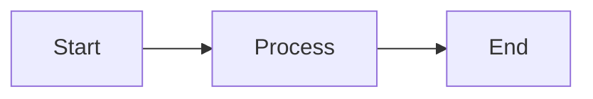

# @swifty.js/rspress-plugin-mermaid

A Rspress v2 plugin that renders `mermaid` code blocks as live SVG diagrams,
with automatic light/dark theme switching.

[](https://www.npmjs.com/package/@swifty.js/rspress-plugin-mermaid)
[](../../LICENSE)

## Installation

```sh
pnpm add @swifty.js/rspress-plugin-mermaid
```

## Usage

Register the plugin in `rspress.config.ts`:

```ts
import { defineConfig } from "@rspress/core";
import rspressPluginMermaid from "@swifty.js/rspress-plugin-mermaid";

export default defineConfig({
  plugins: [
    rspressPluginMermaid({
      // Optional: passthrough to mermaid.initialize()
      mermaidConfig: {
        theme: "default",
      },
    }),
  ],
});
```

Then write diagrams in fenced `mermaid` code blocks anywhere in your docs:

````md

````

## Options

| Option          | Type            | Default | Description                                   |
| --------------- | --------------- | ------- | --------------------------------------------- |
| `mermaidConfig` | `MermaidConfig` | `{}`    | Merged into `mermaid.initialize()` on render. |

## How it works

The plugin replaces each `mermaid` code block with a client-rendered component
(via the Rspress devkit's remark-to-global-component pipeline). On mount the
component:

- Derives the active theme (`dark` vs `default`) from `<html class="...">`.
- Sanitizes React's `useId()` output so it never leaks invalid characters into
  the generated SVG ids and `url(#...)` marker references.
- Renders the diagram once, memoizing on `(code, theme)` so long diagrams are
  never re-parsed on unrelated re-renders.

## Development

```sh
pnpm build       # bundle with tsup
pnpm dev         # watch mode
pnpm typecheck   # tsc --noEmit
```
